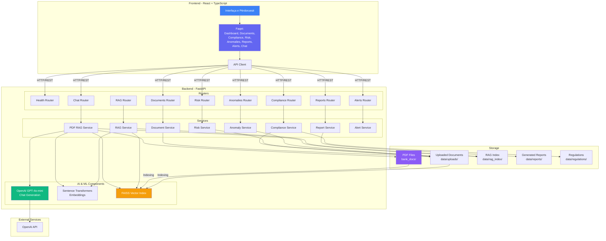
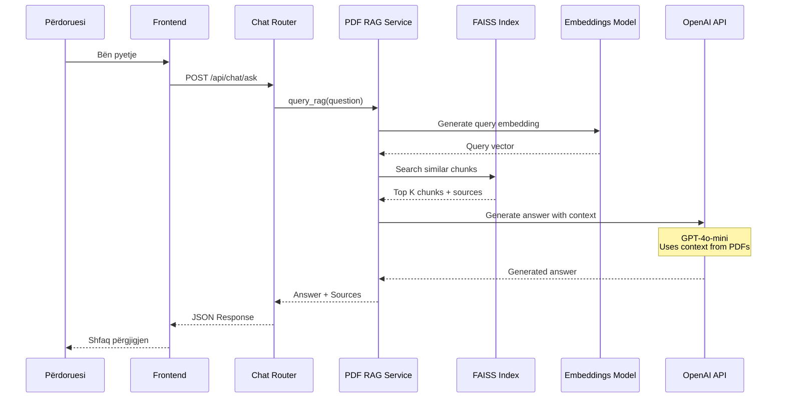
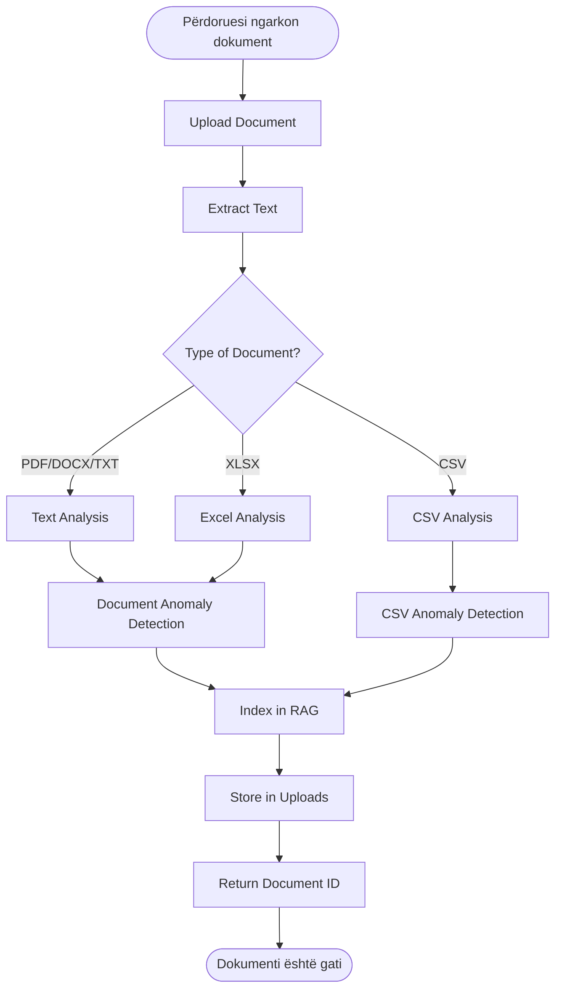
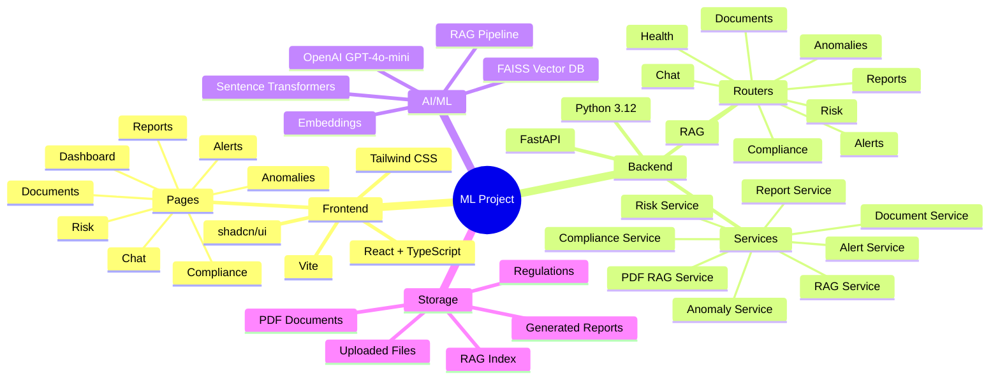
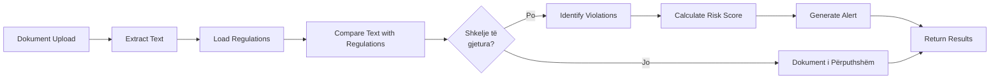
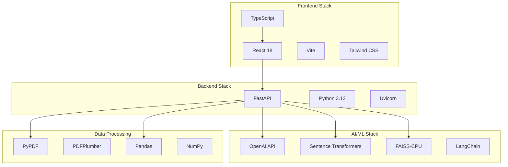

# Arkitektura e Projektit ML - Risk & Compliance Management System

## Diagrami i Arkitekturës

## Rrjedha e të Dhënave - Chat me RAG

## Rrjedha e të Dhënave - Dokument Upload & Processing

## Komponentët e Sistemit

## Rrjedha e Compliance Checking

## Teknologjitë e Përdorura

